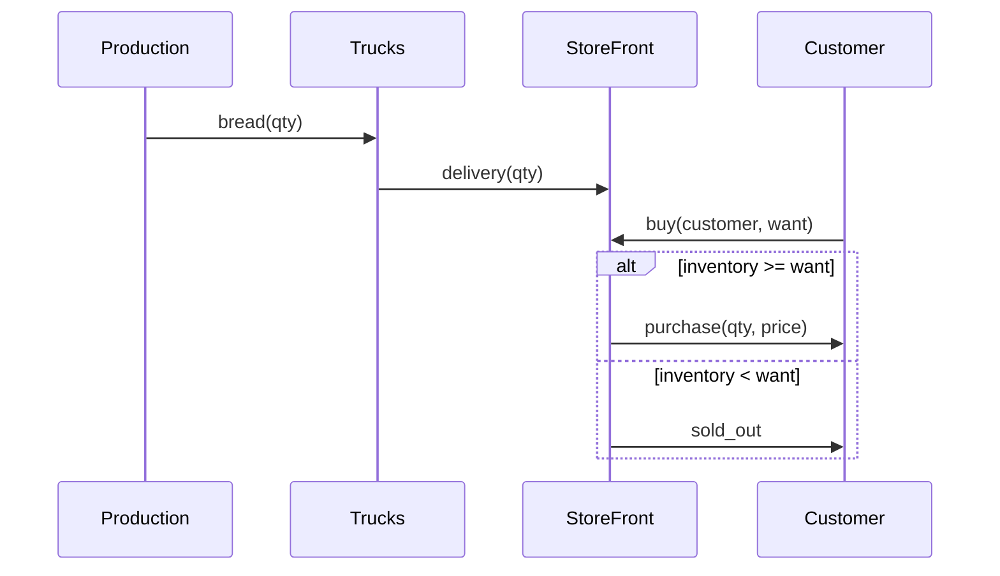
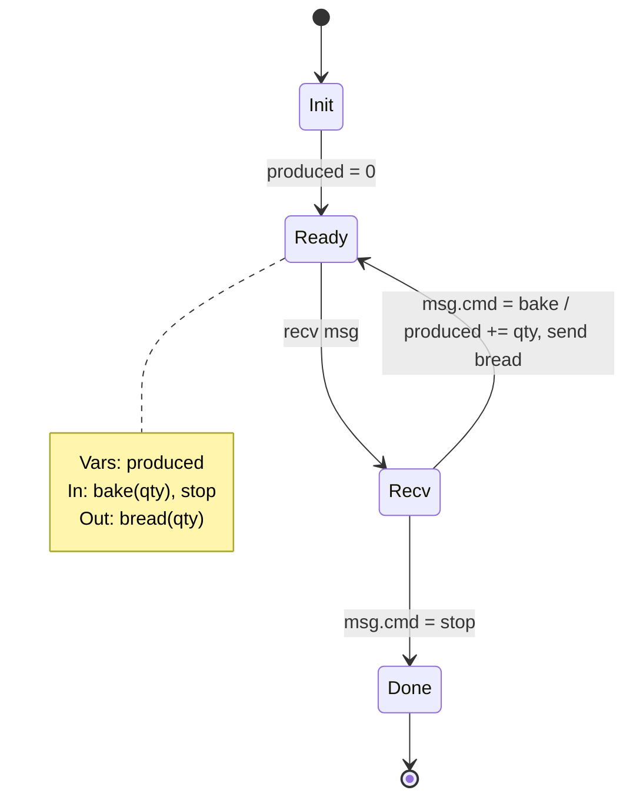
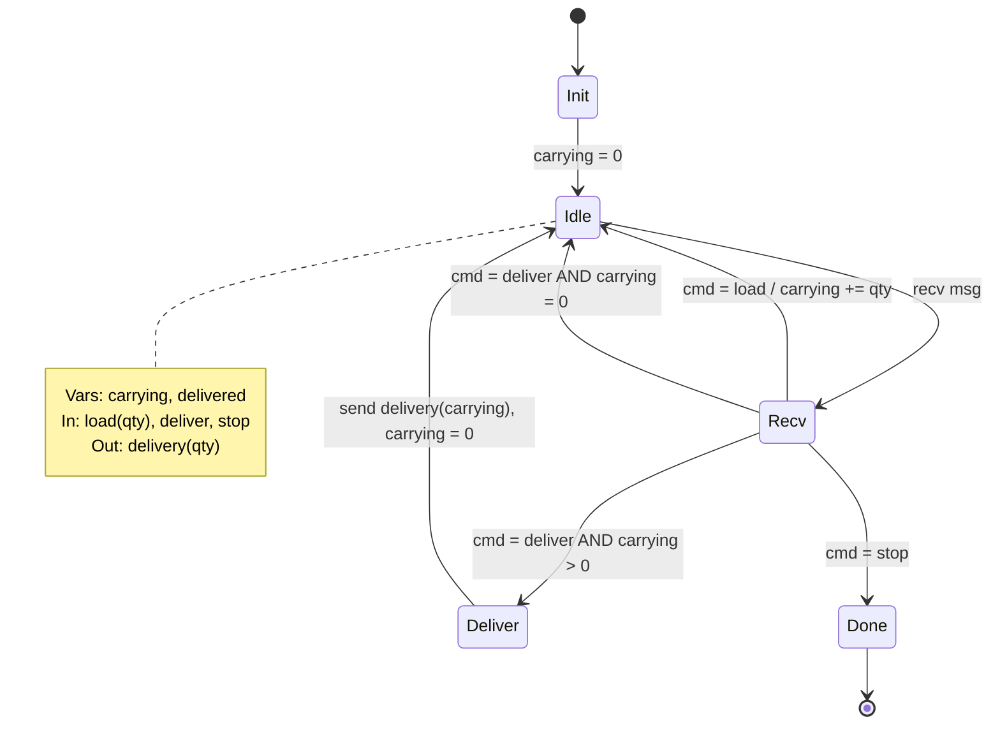
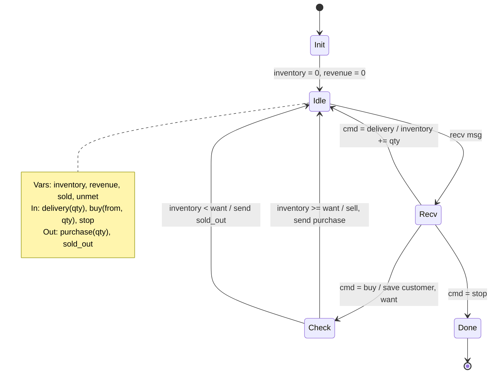
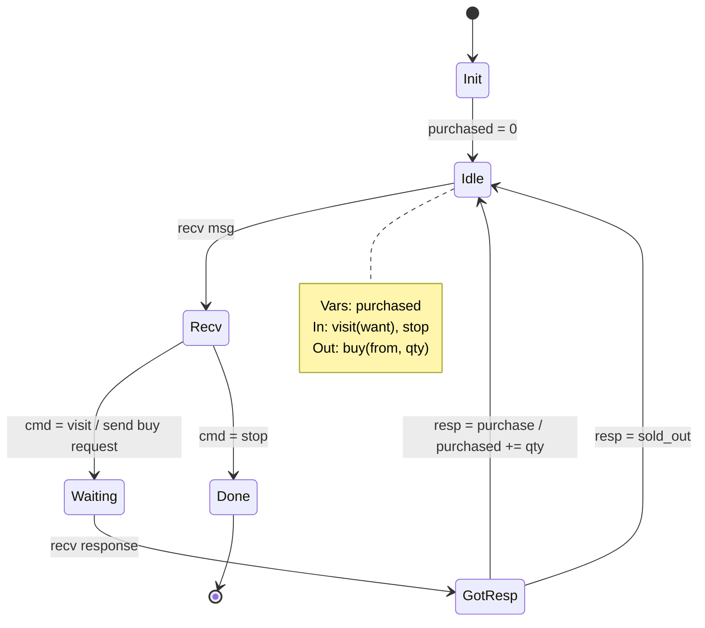
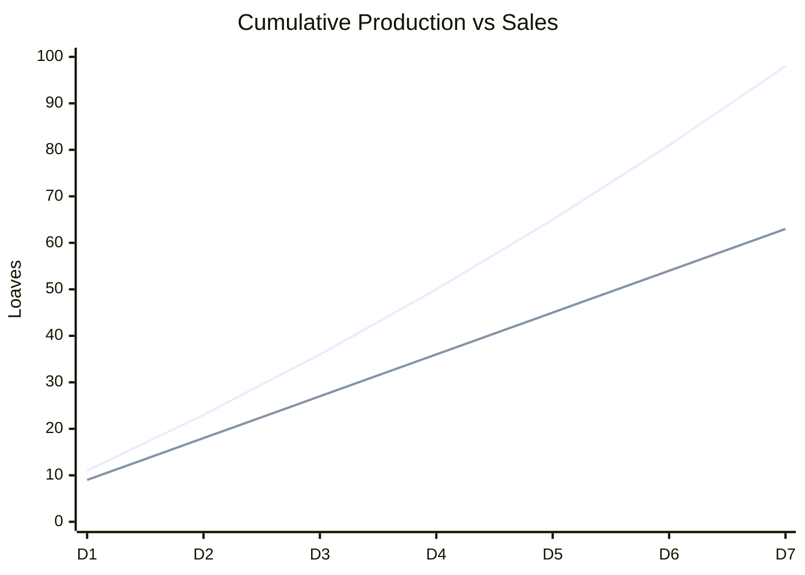
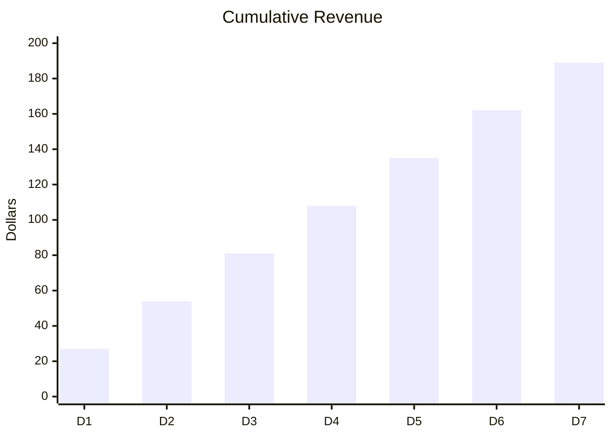

# BreadCo Protocol Specification

## Actors

| Actor | Role | Variables |
|-------|------|-----------|
| Production | Bakes bread | produced : int |
| Trucks | Transports bread | carrying : int |
| StoreFront | Sells to customers | inventory, revenue, sold : int |
| Customer | Buys bread | purchased : int |

## Message Protocol



## Program Graphs

### Production



### Trucks



### StoreFront



### Customer



## Detailed Transition Tables

For precision beyond what mermaid can render:

### StoreFront Transitions

| From | Guard | Action | To |
|------|-------|--------|-----|
| Init | — | inventory := 0; revenue := 0; sold := 0 | Idle |
| Idle | recv ?msg | — | Recv |
| Recv | msg.cmd = 'delivery | inventory := inventory + msg.qty | Idle |
| Recv | msg.cmd = 'buy | customer := msg.from; want := msg.qty | Check |
| Check | inventory >= want | give := min(want, inventory); inventory := inventory - give; sold := sold + give; revenue := revenue + give * 3; send!(customer, purchase(give)) | Idle |
| Check | inventory < want | unmet := unmet + want; send!(customer, sold-out) | Idle |
| Recv | msg.cmd = 'stop | — | Done |

### Customer Transitions

| From | Guard | Action | To |
|------|-------|--------|-----|
| Init | — | purchased := 0 | Idle |
| Idle | recv ?msg | — | Recv |
| Recv | msg.cmd = 'visit | send!(storefront, buy(self, msg.want)) | Waiting |
| Waiting | recv ?response | — | GotResp |
| GotResp | response = 'purchase | purchased := purchased + response.qty | Idle |
| GotResp | response = 'sold-out | — | Idle |
| Recv | msg.cmd = 'stop | — | Done |

## Simulation Results (7 Days)

### Production vs Sales



### Revenue



### Inventory Level

```mermaid
xychart-beta
    title "End of Day Inventory"
    x-axis [D1, D2, D3, D4, D5, D6, D7]
    y-axis "Loaves" 0 --> 40
    line [2, 5, 9, 14, 20, 27, 35]
```

## Properties

| Property | Formal | Status |
|----------|--------|--------|
| No lost bread | AG(produced = delivered + carrying) | ✓ |
| Revenue consistent | AG(revenue = sold * 3) | ✓ |
| No deadlock | AG(EX true) | ✓ |
| Demand eventually met | AG(buy → AF(purchase ∨ sold-out)) | ✓ |

## Key Observations

1. **Inventory accumulating**: Production (98) > Sales (63) → 35 loaves unsold
2. **Revenue linear**: $27/day × 7 = $189 total  
3. **No unmet demand**: All customers served
4. **Recommendation**: Reduce production or add customers
