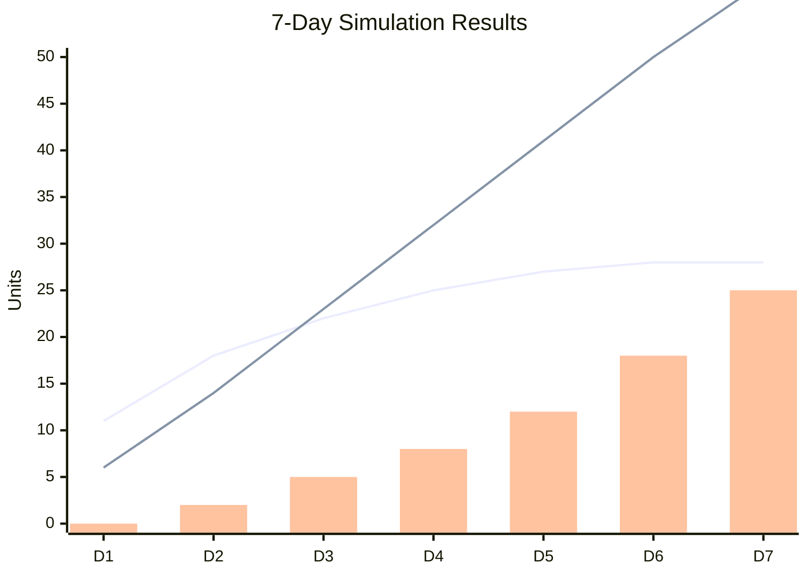

# BreadCo with Datalog Tracing - Full Demo

## Goal

This prompt demonstrates the COMPLETE integration:
1. Actors that **assert facts** during execution
2. Simulation that **runs and collects** facts
3. Rules that **derive relationships**
4. Queries that **verify properties**

## The System

Three actors, fully traced:

```
Production ──bread(qty)──► StoreFront ◄──buy(qty)── Customer
                              │
                              └──► (purchase | sold-out)
```

## Actor Code WITH Tracing

### Production Actor

```lisp
(define (production-loop day)
  (let msg (receive!)
    (cond
      ((eq? (car msg) 'new-day)
       ;; TRACE: Record production event
       (assert! 'production-event day (+ 10 day))
       
       (let qty (+ 10 day)
         (send-to! 'storefront (list 'delivery qty))
         
         ;; TRACE: Record message sent
         (assert! 'sent 'production 'storefront 'delivery qty (datalog-time))
         
         (registry-set! 'bread-produced 
           (+ (registry-get 'bread-produced) qty))
         (list 'become (list 'production-loop (+ day 1)))))
      
      (else (list 'become (list 'production-loop day))))))

(spawn 'production '() '(production-loop 1))
```

### StoreFront Actor

```lisp
(define (storefront-loop inventory revenue)
  (let msg (receive!)
    ;; TRACE: Record guard event
    (assert! 'guard 'storefront 'receive (datalog-time))
    
    (cond
      ((eq? (car msg) 'delivery)
       (let qty (cadr msg)
         ;; TRACE: Record delivery received
         (assert! 'received 'storefront 'delivery qty (datalog-time))
         
         (let new-inv (+ inventory qty)
           ;; TRACE: Record inventory change
           (assert! 'inventory-change 'storefront inventory new-inv (datalog-time))
           
           (registry-set! 'inventory new-inv)
           (list 'become (list 'storefront-loop new-inv revenue)))))
      
      ((eq? (car msg) 'buy)
       (let customer (cadr msg)
         (let want (caddr msg)
           ;; TRACE: Record buy request
           (assert! 'buy-request customer want (datalog-time))
           
           (if (>= inventory want)
             ;; Successful sale
             (let new-inv (- inventory want)
               (let sale-revenue (* want 3)
                 ;; TRACE: Record sale
                 (assert! 'sale customer want sale-revenue (datalog-time))
                 
                 (send-to! customer (list 'purchase want))
                 (assert! 'sent 'storefront customer 'purchase want (datalog-time))
                 
                 (registry-set! 'revenue (+ revenue sale-revenue))
                 (registry-set! 'inventory new-inv)
                 (list 'become (list 'storefront-loop new-inv (+ revenue sale-revenue)))))
             
             ;; Sold out
             (begin
               ;; TRACE: Record unmet demand
               (assert! 'unmet-demand customer want (datalog-time))
               
               (send-to! customer (list 'sold-out))
               (assert! 'sent 'storefront customer 'sold-out 0 (datalog-time))
               
               (list 'become (list 'storefront-loop inventory revenue)))))))
      
      (else (list 'become (list 'storefront-loop inventory revenue))))))

(spawn 'storefront '() '(storefront-loop 0 0))
```

### Customer Actor

```lisp
(define (customer-loop name bought)
  (let msg (receive!)
    ;; TRACE: Record customer guard
    (assert! 'guard name 'receive (datalog-time))
    
    (cond
      ((eq? (car msg) 'shop)
       (let want (+ 1 (random 5)))  ; wants 1-5 loaves
         ;; TRACE: Record shopping intent
         (assert! 'shopping-intent name want (datalog-time))
         
         (send-to! 'storefront (list 'buy name want))
         (assert! 'sent name 'storefront 'buy want (datalog-time))
         
         (list 'become (list 'customer-loop name bought))))
      
      ((eq? (car msg) 'purchase)
       (let qty (cadr msg)
         ;; TRACE: Record successful purchase
         (assert! 'purchased name qty (datalog-time))
         
         (list 'become (list 'customer-loop name (+ bought qty)))))
      
      ((eq? (car msg) 'sold-out)
       ;; TRACE: Record failed purchase
       (assert! 'turned-away name (datalog-time))
       
       (list 'become (list 'customer-loop name bought)))
      
      (else (list 'become (list 'customer-loop name bought))))))

(spawn 'alice '() '(customer-loop 'alice 0))
(spawn 'bob '() '(customer-loop 'bob 0))
```

### Day Controller

```lisp
(define (day-controller day max-days)
  (let msg (receive!)
    (cond
      ((eq? (car msg) 'tick)
       (if (<= day max-days)
         (begin
           ;; TRACE: Record day start
           (assert! 'day-start day (datalog-time))
           (datalog-time! (* day 100))  ; time = day * 100
           
           ;; Trigger daily activities
           (send-to! 'production (list 'new-day))
           (send-to! 'alice (list 'shop))
           (send-to! 'bob (list 'shop))
           
           (list 'become (list 'day-controller (+ day 1) max-days)))
         
         (begin
           ;; TRACE: Record simulation end
           (assert! 'simulation-end day (datalog-time))
           (list 'become '(done)))))
      
      (else (list 'become (list 'day-controller day max-days))))))

(spawn 'controller '() '(day-controller 1 7))
```

## Datalog Rules

### Derived Facts

```lisp
;; Customer who bought something
(rule 'customer
  '(customer ?name)
  '(purchased ?name ?_ ?_))

;; Customer who was turned away
(rule 'disappointed
  '(disappointed ?name)
  '(turned-away ?name ?_))

;; Total sold to customer
(rule 'customer-total
  '(customer-total ?name ?total)
  ; Note: needs aggregation support
  '(purchased ?name ?qty ?_))

;; Inventory was negative (VIOLATION!)
(rule 'inventory-violation
  '(inventory-violation ?old ?new ?time)
  '(inventory-change storefront ?old ?new ?time)
  '(< ?new 0))

;; Message flow: sent then received
(rule 'delivered
  '(delivered ?from ?to ?type ?time)
  '(sent ?from ?to ?type ?_ ?time)
  '(received ?to ?type ?_ ?t2)
  '(> ?t2 ?time))
```

### CSP Verification Rules

```lisp
;; Effect without prior guard
(rule 'csp-violation
  '(csp-violation ?actor ?time)
  '(inventory-change ?actor ?_ ?_ ?time)
  '(not (guard-before ?actor ?time)))

;; Helper: guard happened before time
(rule 'guard-before
  '(guard-before ?actor ?time)
  '(guard ?actor receive ?t)
  '(< ?t ?time))
```

## Running the Simulation

```lisp
;; Initialize metrics
(registry-set! 'bread-produced 0)
(registry-set! 'inventory 0)
(registry-set! 'revenue 0)

;; Enable CSP enforcement
(csp-enforce! true)

;; Run 7 days (each day triggers ~10 scheduler steps)
(dotimes (i 70)
  (send-to! 'controller (list 'tick))
  (step-scheduler 10))
```

## Querying Facts

After simulation, query the collected facts:

```lisp
;; How many facts collected?
(print (list 'total-facts (length (datalog-facts))))

;; All sales
(print "Sales:")
(print (query 'sale '?customer '?qty '?revenue '?time))

;; Unmet demand
(print "Unmet demand:")
(print (query 'unmet-demand '?customer '?qty '?time))

;; Any inventory violations?
(print "Inventory violations:")
(print (query 'inventory-violation '?old '?new '?time))

;; Any CSP violations?
(print "CSP violations:")
(print (query 'csp-violation '?actor '?time))

;; Disappointed customers
(print "Disappointed customers:")
(print (query 'disappointed '?name))
```

## Verifying Properties

```lisp
;; Property 1: Inventory never negative
(print (list 'inventory-always-positive 
  (never? '(inventory-violation ?_ ?_ ?_))))

;; Property 2: Every buy request gets a response
(print (list 'all-requests-answered
  (never? '(unanswered-request ?_ ?_))))

;; Property 3: No CSP violations
(print (list 'csp-compliant
  (never? '(csp-violation ?_ ?_))))

;; Property 4: Eventually some sales happen
(print (list 'sales-occurred
  (eventually? '(sale ?_ ?_ ?_ ?_))))
```

## Expected Output

After 7 days:

```
(total-facts 150)

Sales:
(((customer alice) (qty 3) (revenue 9) (time 100))
 ((customer bob) (qty 2) (revenue 6) (time 100))
 ((customer alice) (qty 4) (revenue 12) (time 200))
 ...)

Unmet demand:
(((customer bob) (qty 5) (time 300))
 ...)

Inventory violations:
()  ; empty = good!

CSP violations:
()  ; empty = good!

(inventory-always-positive true)
(all-requests-answered true)
(csp-compliant true)
(sales-occurred true)
```

## Charts

Generate from facts:

```lisp
;; Extract daily data for xychart
;; Day -> inventory level (from inventory-change facts)
;; Day -> cumulative sales (from sale facts)
;; Day -> unmet demand (from unmet-demand facts)
```



## Questions to Answer from Facts

1. **Which customer bought the most?**
   ```lisp
   (query 'customer-total '?name '?total)
   ```

2. **When did inventory first run low?**
   ```lisp
   (query-all '(inventory-change storefront ?old ?new ?time) '(< ?new 5))
   ```

3. **What's the message delivery rate?**
   ```lisp
   ;; Count sent vs delivered
   ```

4. **Any deadlocks?**
   ```lisp
   (query 'deadlock '?a '?b)
   ```

## Key Integration Points

1. **Every actor calls `(assert! ...)` in its body** - facts flow naturally
2. **`(datalog-time!)` syncs simulation time** - temporal queries work
3. **Rules derive from raw facts** - don't need to assert everything
4. **Queries check properties** - `(never? ...)` and `(eventually? ...)`
5. **CSP + Datalog together** - can trace violations back to source

## Your Task

1. Run this simulation
2. Show me the actual facts collected
3. Verify all 4 properties hold
4. If any violations, show the trace leading to them
5. Generate the xychart from real data
