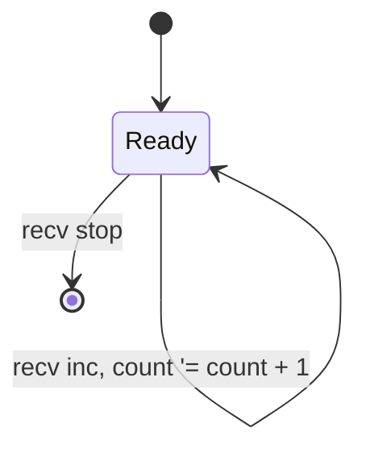

# Test 1: Counter Actor

Build a counter that increments 5 times.

## Expected State Diagram

## Expected Facts (show all 5)

| Time | Fact |
|------|------|
| 1 | counter-value 1 |
| 2 | counter-value 2 |
| 3 | counter-value 3 |
| 4 | counter-value 4 |
| 5 | counter-value 5 |

## Expected Property

AG(count >= 0)

Result: **true**

## Pass Criteria

- [ ] Diagram renders without errors
- [ ] 5 facts shown
- [ ] Property verified true
