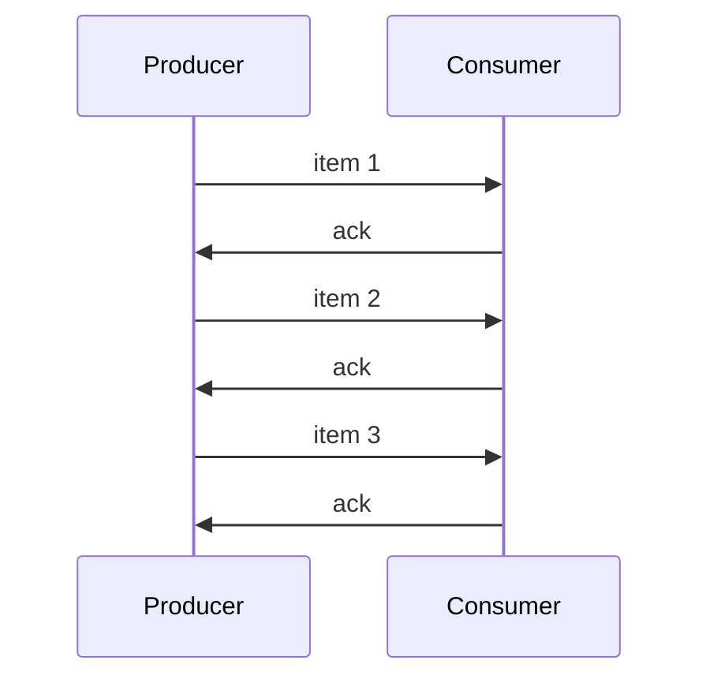

# Test 2: Producer-Consumer

Producer sends 3 items, Consumer acknowledges each.

## Expected Sequence Diagram

## Expected Facts (show 6 of 12)

| From | To | Message |
|------|----|---------|
| producer | consumer | item 1 |
| consumer | producer | ack |
| producer | consumer | item 2 |
| consumer | producer | ack |
| producer | consumer | item 3 |
| consumer | producer | ack |

Total facts: 12 (6 sent + 6 received)

## Expected Property

AG(sent implies eventually received)

Result: **true**

## Pass Criteria

- [ ] Sequence diagram renders
- [ ] 12 facts collected
- [ ] Property verified true
