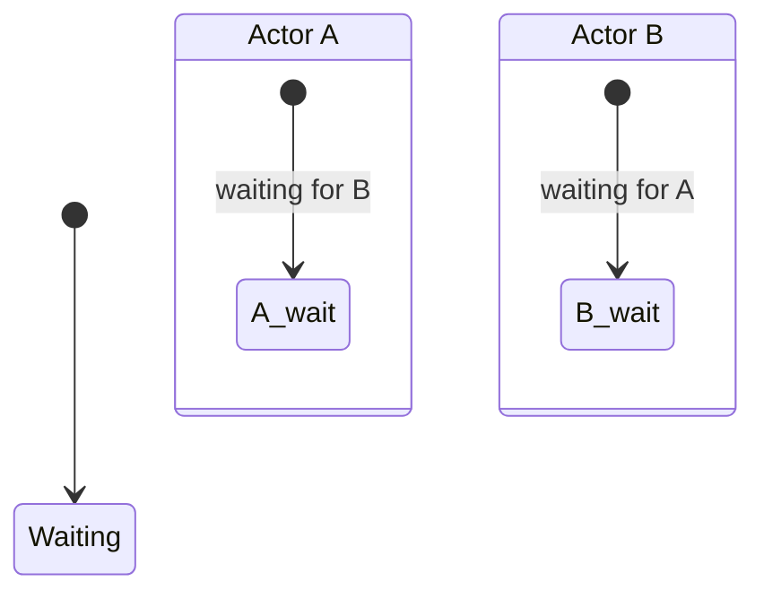

# Test 3: Deadlock Detection

Two actors waiting for each other = deadlock.

## Expected State Diagram

## Expected Facts

| Fact |
|------|
| waiting-for A B |
| waiting-for B A |

## Derived Fact (from rule)

| Fact |
|------|
| deadlock A B |

## Expected Property

AG(not deadlock)

Result: **false** (deadlock exists!)

## Pass Criteria

- [ ] Diagram renders
- [ ] 2 waiting-for facts shown
- [ ] Deadlock detected
- [ ] Property correctly returns false
