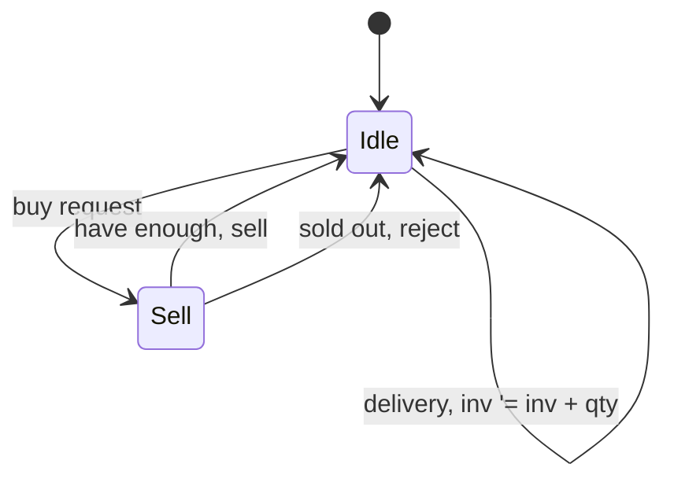
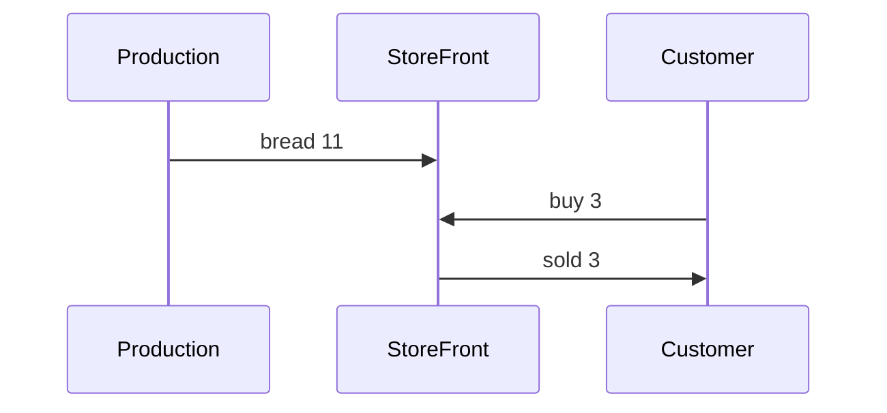
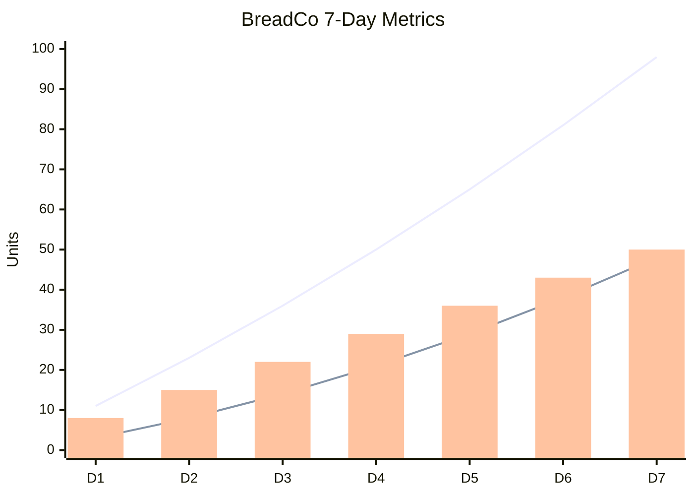

# Test 4: BreadCo 7-Day Simulation

Production -> StoreFront -> Customers

## Expected State Diagram (StoreFront)

## Expected Sequence (Day 1)

## Expected Facts (sample 10 of ~50)

| Day | Event | Value |
|-----|-------|-------|
| 1 | produced | 11 |
| 1 | delivered | 11 |
| 1 | sale | 3 |
| 1 | inventory | 8 |
| 2 | produced | 12 |
| 2 | delivered | 12 |
| 2 | sale | 4 |
| 2 | inventory | 16 |
| 3 | produced | 13 |
| 3 | inventory | 24 |

Total facts: ~50

## Expected Chart

## Expected Properties

1. AG(inventory >= 0): **true**
2. AG(sold implies inventory decreased): **true**
3. EF(inventory > 20): **true**

## Pass Criteria

- [ ] State diagram renders
- [ ] Sequence diagram renders
- [ ] ~50 facts collected, 10 shown
- [ ] xychart renders with simulation data
- [ ] All 3 properties verified
