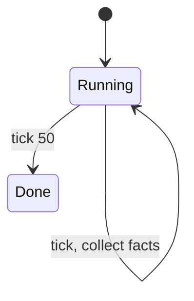

# Test 5: Scale Test - 1000 Facts

Run simulation until 1000 facts collected. Show it works.

## Setup

- 3 producers (each produces 10/tick)
- 3 consumers (each consumes 5/tick)  
- Run for 50 ticks
- Expected: ~1000 facts

## Expected State Diagram

## Expected Facts Summary

| Category | Count |
|----------|-------|
| produced | ~150 |
| consumed | ~150 |
| inventory-change | ~300 |
| message-sent | ~200 |
| message-received | ~200 |
| **Total** | **~1000** |

## Sample Facts (show 20)

| Tick | Actor | Event | Value |
|------|-------|-------|-------|
| 1 | producer-1 | produced | 10 |
| 1 | producer-2 | produced | 10 |
| 1 | producer-3 | produced | 10 |
| 1 | consumer-1 | consumed | 5 |
| 1 | consumer-2 | consumed | 5 |
| 1 | consumer-3 | consumed | 5 |
| 2 | producer-1 | produced | 10 |
| ... | ... | ... | ... |
| 50 | consumer-3 | consumed | 5 |

## Expected Properties

1. AG(total-consumed lte total-produced): **true**
2. AG(inventory >= 0): **true**
3. EF(facts-count > 500): **true**

## Performance

- Time to collect 1000 facts: < 1 second
- Time to query all facts: < 100ms

## Pass Criteria

- [ ] Diagram renders
- [ ] 1000+ facts collected
- [ ] 20 sample facts shown in table
- [ ] Fact counts by category shown
- [ ] All properties verified
- [ ] Performance acceptable
