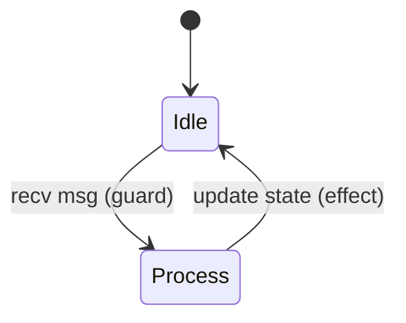

# Test 6: CSP Violation Detection

Build an actor that violates CSP (effect before guard). Detect it.

## The Rule

CSP requires: guard (receive/send) BEFORE effect (state change)

## Expected State Diagram (Correct)



## Expected State Diagram (Violation)

```mermaid
stateDiagram-v2
    [*] --> Bad
    Bad --> Bad: update state (effect first!)
    note right of Bad: VIOLATION: effect before guard
```

## Expected Facts

| Time | Actor | Event | Violation |
|------|-------|-------|-----------|
| 1 | good-actor | guard | no |
| 2 | good-actor | effect | no |
| 1 | bad-actor | effect | YES |
| 2 | bad-actor | guard | - |

## Derived Fact

| Fact |
|------|
| csp-violation bad-actor time-1 |

## Expected Property

AG(guard-before-effect)

Result for good-actor: **true**
Result for bad-actor: **false**

## Pass Criteria

- [ ] Both diagrams render
- [ ] Violation detected in bad-actor
- [ ] Good-actor passes
- [ ] csp-violation fact derived
